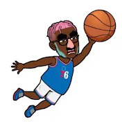

<!DOCTYPE html>
<html lang="en">
<head>
    <meta charset="UTF-8">
    <meta http-equiv="X-UA-Compatible" content="IE=edge">
    <meta name="viewport" content="width=device-width, initial-scale=1.0">
    <link rel="stylesheet" href="/main.css">
    <link rel="stylesheet" href="https://site-assets.fontawesome.com/releases/v6.2.0/css/all.css">
</head>
<body>
    <nav>
         
        <h1>Marquises Unblocked Games</h1>
    </nav>
    

        <h1>Popular:</h1>
        

